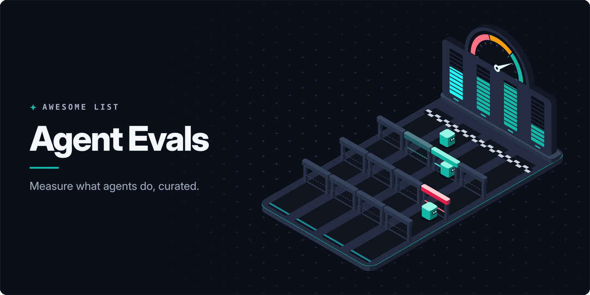

<!-- awesome:hero --><!-- /awesome:hero -->

<!-- awesome:title --><h1 align="center">Awesome Agent Evals</h1><!-- /awesome:title -->

<!-- awesome:tagline -->Evaluation, tracing and observability for AI agents: benchmarks, eval frameworks, tracing SDKs and monitoring platforms.<!-- /awesome:tagline -->

<!-- awesome:badges -->

  
  
  

<!-- /awesome:badges -->

An agent takes many steps, calls tools and keeps state, so knowing whether it works means scoring whole runs and watching them in production. This list covers the standards, tracing platforms, eval frameworks, benchmarks and guides for measuring and observing AI agents.

## Contents

- [Standards and instrumentation](#standards-and-instrumentation)
- [Open-source platforms](#open-source-platforms)
- [Hosted platforms](#hosted-platforms)
  - [Evaluation and observability platforms](#evaluation-and-observability-platforms)
  - [Cloud and monitoring vendors](#cloud-and-monitoring-vendors)
  - [Simulation and voice agent testing](#simulation-and-voice-agent-testing)
- [Eval frameworks](#eval-frameworks)
- [Safety and red teaming](#safety-and-red-teaming)
- [Benchmarks](#benchmarks)
  - [Coding and engineering](#coding-and-engineering)
  - [Web and browser](#web-and-browser)
  - [Computer use and mobile](#computer-use-and-mobile)
  - [Tool use and function calling](#tool-use-and-function-calling)
  - [General and research agents](#general-and-research-agents)
- [Coding agent monitors](#coding-agent-monitors)
- [Guides](#guides)
- [Related lists](#related-lists)
- [Contributing](#contributing)

## Standards and instrumentation

- [LoongSuite Java](https://github.com/alibaba/loongsuite-java) - Alibaba library that emits OpenTelemetry GenAI telemetry from Java agent apps.
- [OpenInference](https://github.com/Arize-ai/openinference) - OpenTelemetry instrumentation and span conventions for LLM and agent frameworks.
- [OpenLIT](https://github.com/openlit/openlit) - OpenTelemetry-native SDK and self-hosted UI that traces LLM, vector store and GPU calls.
- [OpenLLMetry](https://github.com/traceloop/openllmetry) - OpenTelemetry auto-instrumentation for Python LLM and agent frameworks, sent to any backend.
- [OpenLLMetry-JS](https://github.com/traceloop/openllmetry-js) - The TypeScript and Node.js version of OpenLLMetry.
- [OpenTelemetry GenAI semantic conventions](https://opentelemetry.io/docs/specs/semconv/gen-ai/) - Standard span, metric and event names for model calls, tool calls and agent steps.
- [OpenTelemetry GenAI SIG](https://github.com/open-telemetry/community/blob/main/projects/gen-ai.md) - Charter of the OpenTelemetry group that owns the GenAI conventions and instrumentation.
- [OpenTelemetry Python GenAI](https://github.com/open-telemetry/opentelemetry-python-genai) - Upstream OpenTelemetry instrumentation packages for Python GenAI SDKs.
- [Traccia](https://github.com/traccia-ai/traccia-py) - OpenTelemetry-native Python SDK that traces, evaluates and applies policy to agent runs.

## Open-source platforms

- [Agenta](https://github.com/Agenta-AI/agenta) - Self-hostable workspace for versioning prompts and agents, running evals and tracing calls.
- [AgentOps](https://github.com/AgentOps-AI/agentops) - Python SDK for agent session replay, cost tracking and benchmarking across frameworks.
- [AgentSight](https://github.com/eunomia-bpf/agentsight) - eBPF tool that observes agent prompts, processes and file access at the system level.
- [Arize Phoenix](https://github.com/Arize-ai/phoenix) - Trace viewer and eval workbench built on OpenTelemetry, run locally or as a server.
- [Coze Loop](https://github.com/coze-dev/coze-loop) - Agent optimization platform from Coze with prompt debugging, evals and tracing.
- [Failproof AI](https://github.com/FailproofAI/failproofai) - Hooks into agent harnesses to record every run and block dangerous actions.
- [Future AGI](https://github.com/future-agi/future-agi) - Platform for evaluating, tracing and simulating LLM and agent apps.
- [Helicone](https://github.com/Helicone/helicone) - Proxy-based LLM observability that logs requests, cost and latency from a base URL change.
- [Laminar](https://github.com/lmnr-ai/lmnr) - Tracing, evals and session replay built for long-running AI agents.
- [Langfuse](https://github.com/langfuse/langfuse) - Tracing, prompt management, datasets and evals in one self-hostable platform.
- [Langtrace](https://github.com/Scale3-Labs/langtrace) - OpenTelemetry-based tracing and evals for LLM calls, vector stores and frameworks.
- [LangWatch](https://github.com/langwatch/langwatch) - Monitoring, evals and pre-release agent simulations on OpenTelemetry traces.
- [Latitude](https://github.com/latitude-dev/latitude-llm) - Agent observability that groups failures and hands them to a coding agent to fix.
- [MLflow](https://github.com/mlflow/mlflow) - ML platform whose GenAI tracing and evals keep agent runs next to models and experiments.
- [Opik](https://github.com/comet-ml/opik) - Comet's platform for tracing, evaluating and monitoring LLM and agent workflows.
- [PandaProbe](https://github.com/chirpz-ai/pandaprobe) - Agent engineering platform with traces, evals and metrics for debugging runs.
- [Pydantic Logfire](https://github.com/pydantic/logfire) - OpenTelemetry-based observability SDK with built-in tracing for Python agents.
- [RagaAI Catalyst](https://github.com/raga-ai-hub/RagaAI-Catalyst) - Python SDK for tracing, monitoring and evaluating agent workflows.
- [Raindrop Workshop](https://github.com/raindrop-ai/workshop) - Local debugger that streams agent traces and lets a coding agent write evals from them.
- [W&B Weave](https://github.com/wandb/weave) - Weights & Biases toolkit for tracing, comparing and scoring LLM app versions.

## Hosted platforms

### Evaluation and observability platforms

- [Arize AX](https://arize.com) - Enterprise agent observability and evaluation platform from the Phoenix team.
- [Arthur](https://www.arthur.ai) - Measures, monitors and governs enterprise AI systems and agents.
- [Braintrust](https://www.braintrust.dev) - Eval-first platform with datasets, scorers, experiments and production tracing.
- [Confident AI](https://www.confident-ai.com) - Hosted platform for DeepEval with regression testing, tracing and dashboards.
- [Fiddler](https://www.fiddler.ai) - Monitoring, evals and guardrails for enterprise agents and models.
- [Galileo](https://galileo.ai) - Agent observability and evals that score runs with small judge models.
- [HoneyHive](https://www.honeyhive.ai) - Agent tracing, evaluation and monitoring for teams running agents in production.
- [LangSmith](https://www.langchain.com/langsmith) - LangChain's hosted tracing, datasets and LLM-as-judge evals for any agent stack.
- [Openlayer](https://www.openlayer.com) - Testing, monitoring and governance for models and agents in regulated companies.
- [Raindrop](https://www.raindrop.ai) - Production monitoring that finds silent agent failures in real user traffic.
- [Respan](https://www.respan.ai) - Platform, formerly Keywords AI, that routes, monitors and evaluates agent runs.
- [Scorecard](https://www.scorecard.io) - Eval platform for testing agents against scenarios and tracking regressions.

### Cloud and monitoring vendors

- [Amazon Bedrock AgentCore Observability](https://docs.aws.amazon.com/bedrock-agentcore/latest/devguide/observability.html) - AWS dashboards and OpenTelemetry traces for agent sessions, tools and memory.
- [Azure AI Foundry observability](https://learn.microsoft.com/en-us/azure/ai-foundry/concepts/observability) - Microsoft's evaluators, tracing and monitoring for agents built on Foundry.
- [Datadog LLM Observability](https://www.datadoghq.com/product/llm-observability/) - Traces, evals and cost for LLM apps and agents inside Datadog.
- [Dynatrace AI Observability](https://www.dynatrace.com/solutions/ai-observability/) - Monitors LLM and agent services, token use and cost across the Dynatrace stack.
- [Elastic LLM Observability](https://www.elastic.co/observability/llm-monitoring) - Collects traces, logs and cost for LLM and agent apps in Elastic.
- [Grafana Cloud AI Observability](https://grafana.com/docs/grafana-cloud/monitor-applications/ai-observability/) - Dashboards for LLM, vector database and agent telemetry sent over OpenTelemetry.
- [New Relic AI Monitoring](https://newrelic.com/platform/ai-monitoring) - Traces AI responses and agent calls next to the rest of an app's telemetry.
- [OpenAI Evals API](https://platform.openai.com/docs/guides/evals) - Runs graded evals on the OpenAI platform from datasets and grader definitions.
- [PostHog LLM Analytics](https://posthog.com/llm-analytics) - Captures LLM generations and agent traces as product analytics events.
- [Sentry AI Agent Monitoring](https://docs.sentry.io/product/insights/ai/agents/) - Traces agent runs, tool calls and token use next to Sentry errors.
- [Vertex AI Gen AI evaluation](https://cloud.google.com/vertex-ai/generative-ai/docs/models/evaluation-overview) - Google Cloud service that scores model and agent outputs, tool-use trajectories included.

### Simulation and voice agent testing

- [Cekura](https://www.cekura.ai) - Automated QA and monitoring for voice and chat agents through simulated calls.
- [Coval](https://www.coval.ai) - Simulates conversations to test and evaluate voice agents before and after release.
- [Hamming](https://hamming.ai) - Tests voice agents with simulated calls and monitors them in production.
- [Maxim](https://www.getmaxim.ai/products/agent-simulation-evaluation) - Simulates multi-turn users against an agent and scores the runs.
- [Okareo](https://okareo.com) - Simulates real users to test voice and text agents before release.

## Eval frameworks

- [Agent Evaluation](https://github.com/awslabs/agent-evaluation) - AWS framework where an LLM agent holds conversations to test a target agent.
- [agentevals](https://github.com/langchain-ai/agentevals) - Ready-made evaluators that score agent trajectories against a reference or a judge.
- [Autoevals](https://github.com/braintrustdata/autoevals) - Library of model-graded and heuristic scorers, usable with or without Braintrust.
- [ChainForge](https://github.com/ianarawjo/ChainForge) - Visual environment for comparing prompts and models across many inputs at once.
- [continuous-eval](https://github.com/relari-ai/continuous-eval) - Modular metrics that evaluate each stage of an LLM pipeline.
- [DeepEval](https://github.com/confident-ai/deepeval) - Pytest-style framework with agent metrics such as task completion and tool correctness.
- [EvalAssist](https://github.com/IBM/eval-assist) - IBM tool for designing and refining LLM-as-judge criteria.
- [Evalite](https://github.com/mattpocock/evalite) - TypeScript eval runner with a local UI, built on Vitest.
- [Evidently](https://github.com/evidentlyai/evidently) - Python library of evals, tests and monitoring for ML and LLM systems.
- [Giskard](https://github.com/Giskard-AI/giskard-oss) - Scans LLM agents for hallucination, injection and bias, and turns findings into tests.
- [Harbor](https://github.com/harbor-framework/harbor) - Runs agent evals in containers at scale and hosts the Terminal-Bench 2.0 registry.
- [HUD SDK](https://github.com/hud-evals/hud-python) - Defines agent environments once to evaluate and train computer-use and tool agents.
- [Inspect](https://github.com/UKGovernmentBEIS/inspect_ai) - UK AI Security Institute framework for agent, tool-use and sandboxed evals.
- [Inspect Evals](https://github.com/UKGovernmentBEIS/inspect_evals) - Community collection of ready-to-run benchmark implementations for Inspect.
- [judgeval](https://github.com/JudgmentLabs/judgeval) - Judgment Labs SDK that traces agents and scores their runs online and offline.
- [Kiln](https://github.com/Kiln-AI/Kiln) - Desktop app for building evals, synthetic data and fine-tunes for AI systems.
- [OpenAI Evals](https://github.com/openai/evals) - OpenAI's eval framework and open registry of benchmarks.
- [openevals](https://github.com/langchain-ai/openevals) - LangChain's ready-made LLM-as-judge and structured output evaluators.
- [Prompt flow](https://github.com/microsoft/promptflow) - Microsoft toolkit for building, batch-evaluating and tracing LLM flows.
- [Promptfoo](https://github.com/promptfoo/promptfoo) - Declarative CLI that tests prompts, agents and RAG in CI and red-teams them.
- [Pydantic Evals](https://ai.pydantic.dev/evals/) - Code-first library of datasets, cases and evaluators, traced with OpenTelemetry.
- [Ragas](https://github.com/vibrantlabsai/ragas) - Metrics and test set generation for RAG and agent pipelines.
- [Scenario](https://github.com/langwatch/scenario) - Simulates users against an agent so whole conversations can be asserted on.
- [Strands Evals](https://github.com/strands-agents/evals) - Evaluation framework for agents built with the Strands Agents SDK and others.
- [TruLens](https://github.com/truera/trulens) - Instruments apps and scores their internals with feedback functions.

## Safety and red teaming

- [AgentDojo](https://github.com/ethz-spylab/agentdojo) - Environment that measures prompt injection attacks and defenses on tool-using agents.
- [Cybench](https://github.com/andyzorigin/cybench) - Capture-the-flag tasks that measure the offensive security skills of agents.
- [DeepTeam](https://github.com/confident-ai/deepteam) - Red-teaming framework that simulates jailbreaks and injection against LLM and agent apps.
- [garak](https://github.com/NVIDIA/garak) - NVIDIA scanner that probes LLMs for jailbreaks, injection and data leaks.
- [PyRIT](https://github.com/microsoft/PyRIT) - Microsoft framework for automated risk finding and red teaming of generative AI.

## Benchmarks

### Coding and engineering

- [CORE-Bench](https://github.com/siegelz/core-bench) - Tests whether agents can reproduce the results of published research code.
- [Frontier Evals](https://github.com/openai/frontier-evals) - OpenAI's PaperBench, SWE-Lancer and EVMbench code for agentic engineering tasks.
- [MLE-bench](https://github.com/openai/mle-bench) - Kaggle competitions that measure agents at machine learning engineering.
- [Multi-SWE-bench](https://github.com/multi-swe-bench/multi-swe-bench) - Issue resolution benchmark across seven languages beyond Python.
- [SkillsBench](https://github.com/benchflow-ai/skillsbench) - Measures how well agents use skills and how much the skills help them.
- [SWE-bench](https://github.com/SWE-bench/SWE-bench) - Real GitHub issues an agent must resolve with a patch that passes the tests.
- [SWE-bench Pro](https://github.com/scaleapi/SWE-bench_Pro-os) - Scale AI's long-horizon engineering tasks, harder than SWE-bench.
- [Terminal-Bench](https://www.tbench.ai) - Multi-step tasks agents must complete in a real terminal, with a public leaderboard.
- [TheAgentCompany](https://github.com/TheAgentCompany/TheAgentCompany) - Workplace tasks in a simulated software company with chat, code and docs.

### Web and browser

- [AgentLab](https://github.com/ServiceNow/AgentLab) - ServiceNow framework for running and comparing web agents on BrowserGym benchmarks.
- [BrowseComp](https://openai.com/index/browsecomp/) - OpenAI's set of hard-to-find facts that test persistent web browsing.
- [BrowserGym](https://github.com/ServiceNow/BrowserGym) - Gym environment that runs many web agent benchmarks behind one interface.
- [ClawBench](https://github.com/TIGER-AI-Lab/ClawBench) - Everyday tasks on live websites with recorded evidence of what the agent did.
- [Mind2Web](https://github.com/OSU-NLP-Group/Mind2Web) - Dataset of real website tasks for generalist web agents.
- [Online-Mind2Web](https://github.com/OSU-NLP-Group/Online-Mind2Web) - Live-website version of Mind2Web with an automatic judge.
- [WebArena](https://github.com/web-arena-x/webarena) - Self-hosted shopping, forum, GitLab and map sites for realistic web tasks.
- [WorkArena](https://github.com/ServiceNow/WorkArena) - Knowledge-work tasks on the ServiceNow platform for web agents.

### Computer use and mobile

- [AndroidWorld](https://github.com/google-research/android_world) - Reproducible Android environment with tasks across real apps.
- [OSWorld](https://github.com/xlang-ai/OSWorld) - Open-ended tasks on real Ubuntu, Windows and macOS desktops.
- [OSWorld 2.0](https://github.com/xlang-ai/OSWorld-V2) - Long-horizon real-world tasks for computer-use agents, the successor to OSWorld.
- [Windows Agent Arena](https://github.com/microsoft/WindowsAgentArena) - Windows tasks across apps and the OS, run in parallel in the cloud.

### Tool use and function calling

- [AppWorld](https://github.com/StonyBrookNLP/appworld) - Simulated world of apps and people for agents that write API-calling code.
- [Berkeley Function Calling Leaderboard](https://gorilla.cs.berkeley.edu/leaderboard.html) - Ranks models on single, parallel and multi-turn function calls.
- [Galileo Agent Leaderboard](https://github.com/rungalileo/agent-leaderboard) - Ranks models on tool calling and task completion in business scenarios.
- [MCP-Atlas](https://github.com/scaleapi/mcp-atlas) - Scale AI benchmark of tool-use tasks across real MCP servers, scored by a judge.
- [MCP-Universe](https://github.com/SalesforceAIResearch/MCP-Universe) - Salesforce framework for benchmarking agents on real MCP servers.
- [MCPMark](https://github.com/eval-sys/mcpmark) - Stress-test benchmark of realistic tasks across MCP servers.
- [tau2-bench](https://github.com/sierra-research/tau2-bench) - Sierra's customer service benchmark where the agent and a simulated user share control.
- [ToolSandbox](https://github.com/apple-aiml-research/ToolSandbox) - Apple's stateful, conversational tool-use benchmark.
- [VAKRA](https://github.com/IBM/vakra) - IBM benchmark for multi-hop tool calling across APIs and documents.

### General and research agents

- [AgentBench](https://github.com/THUDM/AgentBench) - Eight environments, from operating systems to games, for LLMs acting as agents.
- [AssetOpsBench](https://github.com/IBM/AssetOpsBench) - IBM benchmark for agents that run industrial asset operations.
- [Claw-Eval](https://github.com/claw-eval/claw-eval) - Human-verified tasks for evaluating LLMs as agents.
- [DeepResearch Bench](https://github.com/Ayanami0730/deep_research_bench) - PhD-level research tasks that score the reports of deep research agents.
- [GAIA](https://huggingface.co/datasets/gaia-benchmark/GAIA) - Real-world questions that need browsing, tools and reasoning to answer.
- [HAL](https://hal.cs.princeton.edu) - Princeton's Holistic Agent Leaderboard, comparing agents on accuracy and cost.
- [Vending-Bench](https://andonlabs.com/evals/vending-bench) - Andon Labs test of long-term coherence where an agent runs a vending business.

## Coding agent monitors

- [abtop](https://github.com/graykode/abtop) - Terminal monitor for Claude Code and Codex sessions, tokens and context.
- [Agent Console](https://github.com/LockedinLabs-AI/agent-console) - Local console of Claude Code and Codex sessions, tokens, cache use and cost.
- [agents-observe](https://github.com/simple10/agents-observe) - Real-time view of Claude Code sessions and their subagents.
- [AgentsView](https://github.com/kenn-io/agentsview) - Local search, analytics and cost tracking across coding agent session archives.
- [agenttrail](https://github.com/sodiumsun/agenttrail) - Local live view of what coding agents are changing in a project.
- [Claude Code Agent Monitor](https://github.com/hoangsonww/Claude-Code-Agent-Monitor) - Real-time dashboard of Claude Code and Codex sessions and tool use.
- [Claude Code Hooks Multi-Agent Observability](https://github.com/disler/claude-code-hooks-multi-agent-observability) - Streams Claude Code hook events from many agents to a live dashboard.
- [OpenClaw Monitor](https://github.com/flik2002/openclaw-monitor) - Local dashboard for OpenClaw AI agents showing token usage, sessions and weekly trends.

## Guides

- [AI agent observability](https://opentelemetry.io/blog/2025/ai-agent-observability/) - OpenTelemetry post on where the GenAI conventions stand for agents and frameworks.
- [Demystifying evals for AI agents](https://www.anthropic.com/engineering/demystifying-evals-for-ai-agents) - Anthropic's guide to designing graders and eval suites for agents.
- [Eval skills](https://github.com/ai-evals-course/evals-skills) - Agent skills that walk a coding agent through building product-specific evals.
- [Evals FAQ](https://hamel.dev/blog/posts/evals-faq/) - Hamel Husain and Shreya Shankar's answers to common questions on LLM evals.
- [Evaluate agents with ADK](https://google.github.io/adk-docs/evaluate/) - Google ADK docs on scoring agent trajectories and final responses.
- [LLM Evaluation Guidebook](https://github.com/huggingface/evaluation-guidebook) - Hugging Face's practical and theoretical notes on evaluating LLMs.
- [OpenAI Agents SDK tracing](https://openai.github.io/openai-agents-python/tracing/) - How the Agents SDK records runs, tool calls and handoffs as traces.
- [Your AI product needs evals](https://hamel.dev/blog/posts/evals/) - Hamel Husain's case for layered evals, from unit tests to human review.

## Related lists

- [Awesome Agent Observability](https://github.com/anhermon/awesome-agent-observability) - Tracing standards, platforms and eval tools for LLM and agent apps.
- [Awesome AI Eval](https://github.com/Vvkmnn/awesome-ai-eval) - Tools, methods and platforms for evaluating AI reliability.
- [Awesome Evals](https://github.com/benchflow-ai/awesome-evals) - Papers, blogs and tools for building and evaluating AI agents.
- [Awesome LLM Observability](https://github.com/ContextJet-ai/awesome-llm-observability) - LLM observability tools plus agent skills for using them.
- [Awesome-LLM-Eval](https://github.com/onejune2018/Awesome-LLM-Eval) - Tools, benchmarks, leaderboards and papers on LLM evaluation.
- [LLM Agent Benchmark List](https://github.com/zhangxjohn/LLM-Agent-Benchmark-List) - Benchmarks for evaluating LLM agents and the models behind them.

## Contributing

Contributions are welcome. Read the [contribution guidelines](contributing.md) first.

<!-- awesome:maintainer -->
Maintained by [Ian Wiedenman](https://github.com/ianwieds).
<!-- /awesome:maintainer -->
